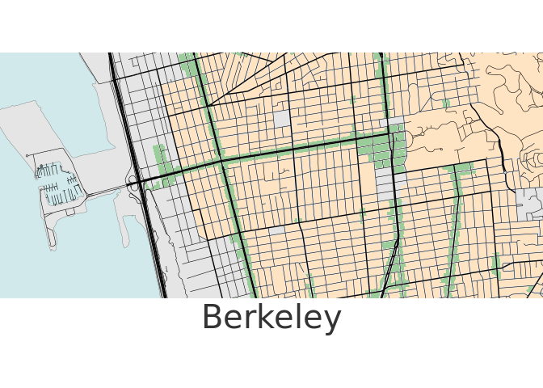

Berkeley Map
================
Zachary del Rosario
2019-12-28

Berkeley CA map, following [this
tutorial](https://taraskaduk.com/2019/12/20/print-maps/).

## Setup & Download

``` r
library(sf)
```

    ## Linking to GEOS 3.7.1, GDAL 2.4.0, PROJ 5.2.0

``` r
library(tidyverse)
```

    ## ── Attaching packages ─────────────────────────────────────────────── tidyverse 1.3.0 ──

    ## ✓ ggplot2 3.2.1     ✓ purrr   0.3.3
    ## ✓ tibble  2.1.3     ✓ dplyr   0.8.3
    ## ✓ tidyr   1.0.0     ✓ stringr 1.4.0
    ## ✓ readr   1.3.1     ✓ forcats 0.4.0

    ## ── Conflicts ────────────────────────────────────────────────── tidyverse_conflicts() ──
    ## x dplyr::filter() masks stats::filter()
    ## x dplyr::lag()    masks stats::lag()

``` r
library(raster)
```

    ## Loading required package: sp

    ## 
    ## Attaching package: 'raster'

    ## The following object is masked from 'package:dplyr':
    ## 
    ##     select

    ## The following object is masked from 'package:tidyr':
    ## 
    ##     extract

``` r
url_boundary <- "https://data.cityofberkeley.info/api/geospatial/6is2-y2ia?method=export&format=Shapefile"
url_streets <- "https://data.cityofberkeley.info/api/geospatial/hqnk-qfhq?method=export&format=Shapefile"
url_zones <- "https://data.cityofberkeley.info/api/geospatial/2dtu-vge3?method=export&format=Shapefile"

curl::curl_download(url_boundary, destfile = "../data/berkeley_boundary.shp.zip")
curl::curl_download(url_streets, destfile = "../data/berkeley_streets.shp.zip")
curl::curl_download(url_zones, destfile = "../data/berkeley_zones.shp.zip")
# curl::curl_download(url_water, destfile = "../data/boston_water.shp.zip")

unzip("../data/berkeley_boundary.shp.zip", exdir = "../data")
unzip("../data/berkeley_streets.shp.zip", exdir = "../data")
unzip("../data/berkeley_zones.shp.zip", exdir = "../data")
# unzip("../data/boston_water.shp.zip", exdir = "../data")
```

``` r
df_boundary <- sf::read_sf("../data", "geo_export_b1a00a47-bdd5-4682-a683-5029c32ebbc2")
df_streets <- sf::read_sf("../data", "geo_export_2e435363-acc8-45bb-af5e-40d26d5fcafe")
df_zones <- sf::read_sf("../data", "geo_export_7d564c47-0c9f-4f15-9270-63ff2cac12c0")
# df_water <- sf::read_sf("../data", "Hydrography_Polygon")
```

## Wrangling data

### Streets

To assign appropriate visual weight to the various streets, here we
explore the levels of `category` in the street data.

``` r
df_streets %>% count(category)
```

    ## Simple feature collection with 7 features and 2 fields
    ## geometry type:  MULTILINESTRING
    ## dimension:      XY
    ## bbox:           xmin: -122.3246 ymin: 37.8361 xmax: -122.2086 ymax: 37.94531
    ## epsg (SRID):    4326
    ## proj4string:    +proj=longlat +ellps=WGS84 +no_defs
    ## # A tibble: 7 x 3
    ##   category        n                                                     geometry
    ## * <chr>       <int>                                        <MULTILINESTRING [°]>
    ## 1 CONNECTOR     186 ((-122.2969 37.83815, -122.297 37.8381, -122.2971 37.83805,…
    ## 2 HIGHWAY       195 ((-122.2654 37.83679, -122.2654 37.83681, -122.2654 37.8368…
    ## 3 MAJOR        1412 ((-122.2609 37.83706, -122.2609 37.83706, -122.2608 37.8370…
    ## 4 MINOR        4926 ((-122.2711 37.83685, -122.2711 37.83686, -122.2711 37.8368…
    ## 5 PEDESTRIAN    234 ((-122.3113 37.83731, -122.3113 37.83731, -122.3113 37.8373…
    ## 6 Private Ro…     1 ((-122.3002 37.8661, -122.3004 37.86667, -122.3004 37.86696…
    ## 7 <NA>           15 ((-122.2693 37.90475, -122.2693 37.90426, -122.2693 37.9042…

``` r
df_streets_filled <- 
  df_streets %>% 
  mutate(category = if_else(is.na(category), "MINOR", category))
```

Let’s assign different weights to different street types:

``` r
size_small <- 0.2
size_mid <- 0.5
size_large <- 0.7

size_streets <- 
  c(
    "MINOR" = size_small,
    "MAJOR" = size_mid,
    "PEDESTRIAN" = size_small,
    "CONNECTOR" = size_small,
    "Private Road" = size_small,
    "HIGHWAY" = size_large
  )
```

### Zones

Let’s see what zones are in the data.

``` r
df_zones %>% count(zone)
```

    ## Simple feature collection with 11 features and 2 fields
    ## geometry type:  MULTIPOLYGON
    ## dimension:      XY
    ## bbox:           xmin: -122.3248 ymin: 37.84586 xmax: -122.2342 ymax: 37.90561
    ## epsg (SRID):    4326
    ## proj4string:    +proj=longlat +ellps=WGS84 +no_defs
    ## # A tibble: 11 x 3
    ##    zone      n                                                          geometry
    ##  * <chr> <int>                                                <MULTIPOLYGON [°]>
    ##  1 C       318 (((-122.2705 37.84694, -122.2704 37.84656, -122.2708 37.84651, -…
    ##  2 C-W       1 (((-122.2982 37.88096, -122.2982 37.88097, -122.2974 37.88113, -…
    ##  3 M        18 (((-122.3039 37.87226, -122.3036 37.87148, -122.3045 37.8713, -1…
    ##  4 MM        3 (((-122.2968 37.85767, -122.2936 37.85832, -122.2931 37.85701, -…
    ##  5 MULI     66 (((-122.2953 37.84866, -122.2968 37.84831, -122.2968 37.84836, -…
    ##  6 MUR      38 (((-122.2917 37.85537, -122.2914 37.85542, -122.2914 37.85518, -…
    ##  7 R      1356 (((-122.2755 37.84591, -122.2755 37.84591, -122.2755 37.84591, -…
    ##  8 SP        4 (((-122.301 37.84745, -122.301 37.84754, -122.301 37.84776, -122…
    ##  9 U        14 (((-122.2985 37.84978, -122.2985 37.84983, -122.2985 37.84985, -…
    ## 10 X         1 (((-122.2723 37.89013, -122.2723 37.89012, -122.2723 37.89012, -…
    ## 11 <NA>     44 (((-122.2695 37.87293, -122.2696 37.87338, -122.2696 37.87367, -…

Assign manual colors to the zones.

``` r
fill_zones <- 
  c(
    "C" = "darkseagreen3",
    "C-W" = "darkseagreen3",
    "R" = "bisque",
    
    "X" = NA,
    "U" = NA,
    "SP" = NA,
    "M" = NA,
    "MM" = NA,
    "MULI" = NA,
    "MUR" = NA
  )
```

## Visualization

``` r
## Plot
ggplot() +
  geom_sf(
    data = df_boundary,
    fill = "grey90",
    color = "grey20",
    size = 0.09
  ) +
  geom_sf(
    data = df_zones,
    aes(fill = zone),
    size = 0.01
  ) +
  geom_sf(
    data = df_streets_filled,
    aes(size = category)
  ) +
  ## Tail
  scale_size_manual(values = size_streets) +
  scale_fill_manual(values = fill_zones) +
  coord_sf(
    xlim = c(-122.32, -122.25),
    ylim = c(+37.855, +37.88)
  ) +
  theme_void() +
  # theme_minimal() +
  theme(
    panel.background = element_rect(
      fill = "#d1e9eb"
    ),

    legend.position = "none",
    plot.caption = element_text(
      color = "grey20",
      size = 30,
      hjust = 0.5,
      face = "plain",
      family = "Didot"
    )
  ) +
  labs(
    caption = "Berkeley"
  )
```

<!-- -->

``` r
# ggsave("map.png", width = 297, height = 420, units = "mm", dpi = "retina")
ggsave("../images/berkeley.svg")
```

    ## Saving 7 x 5 in image
