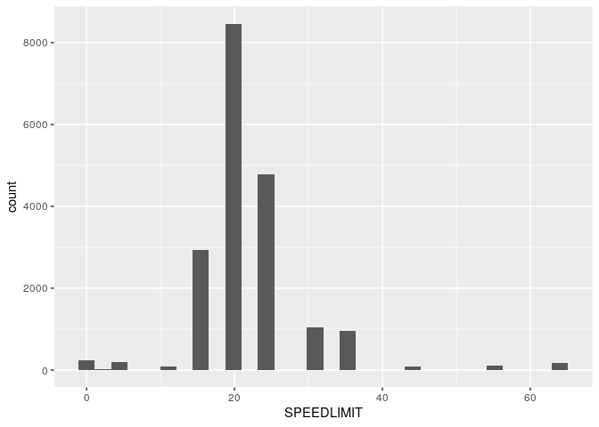
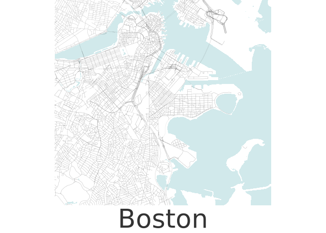

Boston Map
================
Zachary del Rosario
2019-12-28

Boston map, following [this
tutorial](https://taraskaduk.com/2019/12/20/print-maps/).

``` r
library(sf)
```

    ## Linking to GEOS 3.7.1, GDAL 2.4.0, PROJ 5.2.0

``` r
library(tidyverse)
```

    ## ── Attaching packages ─────────────────────────────────────────────────────── tidyverse 1.3.0 ──

    ## ✓ ggplot2 3.2.1     ✓ purrr   0.3.3
    ## ✓ tibble  2.1.3     ✓ dplyr   0.8.3
    ## ✓ tidyr   1.0.0     ✓ stringr 1.4.0
    ## ✓ readr   1.3.1     ✓ forcats 0.4.0

    ## ── Conflicts ────────────────────────────────────────────────────────── tidyverse_conflicts() ──
    ## x dplyr::filter() masks stats::filter()
    ## x dplyr::lag()    masks stats::lag()

``` r
library(raster)
```

    ## Loading required package: sp

    ## 
    ## Attaching package: 'raster'

    ## The following object is masked from 'package:dplyr':
    ## 
    ##     select

    ## The following object is masked from 'package:tidyr':
    ## 
    ##     extract

Set projections

``` r
# ESRI projection for mapping.
# https://spatialreference.org/ref/esri/europe-albers-equal-area-conic/ for reference
crs1 <- 102013
crs2 <- 4326
```

``` r
url_boundary <- "http://bostonopendata-boston.opendata.arcgis.com/datasets/142500a77e2a4dbeb94a86f7e0b568bc_9.zip"
url_streets <- "http://bostonopendata-boston.opendata.arcgis.com/datasets/cfd1740c2e4b49389f47a9ce2dd236cc_8.zip"
url_water <- "http://bostonopendata-boston.opendata.arcgis.com/datasets/2b3c0fa13b1c468eb702a3645fcc6bcb_5.zip"

curl::curl_download(url_boundary, destfile = "../data/boston_boundary.shp.zip")
curl::curl_download(url_streets, destfile = "../data/boston_streets.shp.zip")
curl::curl_download(url_water, destfile = "../data/boston_water.shp.zip")

unzip("../data/boston_boundary.shp.zip", exdir = "../data")
unzip("../data/boston_streets.shp.zip", exdir = "../data")
unzip("../data/boston_water.shp.zip", exdir = "../data")
```

``` r
url_cambridge_streets <- "http://gis.cambridgema.gov/download/shp/TRANS_Centerlines.shp.zip"

curl::curl_download(url_cambridge_streets, destfile = "../data/cambridge_streets.shp.zip")

unzip("../data/cambridge_streets.shp.zip", exdir = "../data")
```

``` r
df_boundary <- sf::read_sf("../data", "City_of_Boston_Boundary")
df_streets <- sf::read_sf("../data", "Boston_Street_Segments")
df_water <- sf::read_sf("../data", "Hydrography_Polygon")

df_cambridge_streets <- sf::read_sf("../data", "TRANS_Centerlines")
```

Street categorization: The Cambridge streets are helpfully sorted into
major and minor roads by the `MajorRoad` column, which takes values from
0-2.

``` r
df_cambridge_streets %>%
  count(MajorRoad)
```

    ## Simple feature collection with 3 features and 2 fields
    ## geometry type:  MULTILINESTRING
    ## dimension:      XY
    ## bbox:           xmin: 747668.8 ymin: 2953402 xmax: 772796.4 ymax: 2972688
    ## epsg (SRID):    2249
    ## proj4string:    +proj=lcc +lat_1=42.68333333333333 +lat_2=41.71666666666667 +lat_0=41 +lon_0=-71.5 +x_0=200000.0001016002 +y_0=750000 +ellps=GRS80 +towgs84=0,0,0,0,0,0,0 +units=us-ft +no_defs
    ## # A tibble: 3 x 3
    ##   MajorRoad     n                                                       geometry
    ## *     <int> <int>                             <MULTILINESTRING [US_survey_foot]>
    ## 1         0  1717 ((763040.1 2954117, 763034 2954159, 763012.2 2954305, 763002.…
    ## 2         1   282 ((761382.2 2954498, 761359.3 2954487, 761294.9 2954468, 76126…
    ## 3         2   626 ((761443.6 2954069, 761442.3 2954046, 761437.1 2954000, 76138…

These are probably ordered from 0: minor to 2: major.

Let’s use the speed limits on Boston roads to do a similar categorizing:

``` r
df_streets %>%
  ggplot(aes(SPEEDLIMIT)) +
  geom_histogram()
```

    ## `stat_bin()` using `bins = 30`. Pick better value with `binwidth`.

<!-- -->

``` r
df_streets_labeled <-
  df_streets %>%
  mutate(MajorRoad = if_else(SPEEDLIMIT >= 30, 0, 3))
```

``` r
## Plot
ggplot() +
  geom_sf(
    data = df_water,
    color = "darkslateblue",
    fill = "#d1e9eb",
    size = 0.01,
    alpha = 1
  ) +
  ## Roads
  geom_sf(
    data = df_streets_labeled %>% mutate(MajorRoad = as.factor(MajorRoad)),
    aes(size = MajorRoad)
  ) +
  geom_sf(
    data = df_cambridge_streets %>% mutate(MajorRoad = as.factor(MajorRoad)),
    # aes(size = MajorRoad)
    size = 0.04
  ) +
  ## Tail
  scale_size_manual(
    values = c(`0` = 0.02, `1` = 0.02, `2` = 0.02, `3` = 0.05)
  ) +
  coord_sf(
    xlim = c(-71.1, -71.0),
    ylim = c(+42.3, +42.37)
  ) +
  theme_void() +
  # theme_minimal() +
  theme(
    panel.background = element_rect(
      fill = "white"
    ),

    legend.position = "none",
    plot.caption = element_text(
      color = "grey20",
      size = 40,
      hjust = .5,
      face = "plain",
      family = "Didot"
    )
  ) +
  labs(
    caption = "Boston"
  )
```

<!-- -->
